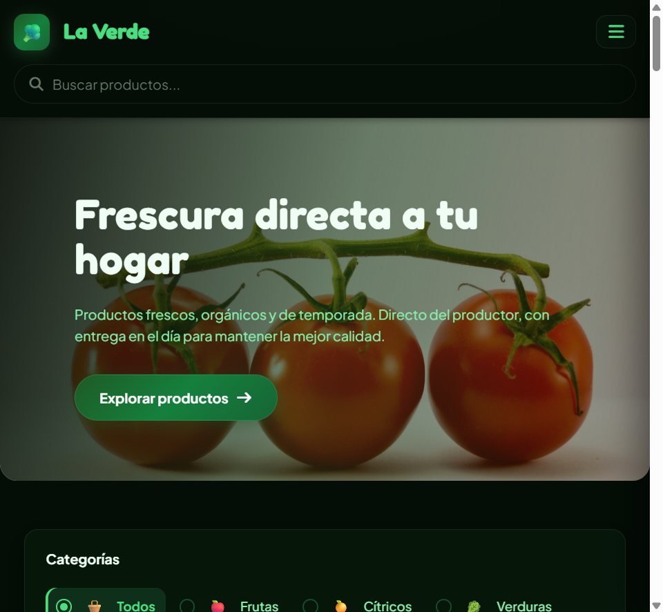

# 🌿 LaVerde Tienda

**Live Demo:** [https://laverde-frontend.onrender.com/](https://laverde-frontend.onrender.com/)

[](LICENSE)
[](https://github.com/Jorgeotero1998/LaVerde-Tienda/actions/workflows/ci.yml)
[](https://www.python.org)
[](https://react.dev)
[](https://laverde-frontend.onrender.com)
[](https://laverde-backend.onrender.com/api)

Production-ready full-stack grocery e-commerce — React 19, Flask, PostgreSQL — with product catalog, cart drawer, checkout, JWT auth, and admin panel. Built and deployed by Jorge Otero (Full Stack Developer, building since 2023) as a 4Geeks Academy capstone, now maintained as a flagship portfolio project.

<p align="center">
  <a href="https://laverde-frontend.onrender.com/">
    
  </a>
  <br/>
  <sub><i>Live storefront — premium dark UI, category filters, cart drawer, and checkout.</i></sub>
</p>

> **Note for recruiters:** Frontend and backend run on Render free tier — first load may take ~30–60s while services wake up. The catalog renders from cache instantly; signup/login need the backend awake.

| Service | URL |
|---|---|
| 🖥️ Frontend | https://laverde-frontend.onrender.com |
| ⚙️ Backend API | https://laverde-backend.onrender.com/api |
| 🛡️ Admin panel | https://laverde-backend.onrender.com/admin |
| ❤️ Health | https://laverde-backend.onrender.com/health |

---

## Architecture

```
Browser (React SPA on Render Static)
    │  REACT_APP_BACKEND_URL → laverde-backend.onrender.com
    ▼
Flask REST API (/api/*) + JWT + CORS
    │
    ├── PostgreSQL (production) / SQLite (local)
    ├── Cloudinary (product images, optional)
    └── Flask-Admin (/admin)
```

**Resilience:** API client retries GET requests on cold start; product catalog caches in `localStorage`; backend self-heals DB schema + seeds demo catalog at boot on Render.

---
## 🚀 Tecnologías

### Backend
- **Framework:** Flask (Python)
- **Base de datos:** PostgreSQL (producción) / SQLite (desarrollo)
- **ORM:** SQLAlchemy + Flask-Migrate
- **Seguridad:** JWT (JSON Web Tokens) + Werkzeug password hashing
- **Almacenamiento de imágenes:** Cloudinary
- **Deploy:** Render

### Frontend
- **Framework:** React (Create React App)
- **Estilos:** Bootstrap 5 + CSS personalizado
- **Routing:** React Router v7
- **Deploy:** Render (Static Site)

---

## 📸 Screenshots


---

## 🛠️ Estructura del proyecto

```
LaVerde-Tienda/
├── src/                  # Backend Flask
│   └── api/
│       ├── models.py     # Modelos SQLAlchemy
│       ├── routes.py     # Endpoints de la API
│       ├── admin.py      # Panel de administración
│       └── commands.py   # Comandos Flask CLI
├── tienda-frontend/      # Frontend React
│   └── src/
│       ├── views/        # Páginas de la app
│       ├── components/   # Componentes reutilizables
│       ├── flux.js       # Estado global (acciones)
│       └── api/client.js # Cliente HTTP
├── render.yaml           # Configuración de deploy
└── requirements.txt      # Dependencias Python
```

---

## ⚙️ Correr en local

### Requisitos previos
- Python 3.10+
- Node.js 18+
- Git

### 1. Clonar el repositorio
```bash
git clone https://github.com/Jorgeotero1998/LaVerde-Tienda.git
cd LaVerde-Tienda
```

### 2. Configurar el backend
```bash
# Crear entorno virtual
python -m venv .venv

# Activar (Windows)
.\.venv\Scripts\Activate.ps1

# Instalar dependencias
pip install -r requirements.txt

# Copiar variables de entorno
cp .env.example .env
```

### 3. Correr backend y frontend

Abrí **dos terminales** desde la raíz del proyecto:

**Terminal 1 — Backend** (http://127.0.0.1:3001):
```powershell
.\.venv\Scripts\Activate.ps1
.\scripts\iniciar-backend.ps1
```

**Terminal 2 — Frontend** (http://localhost:3000):
```powershell
.\scripts\iniciar-frontend.ps1
```

---

## 🐳 Docker (local)

### Desarrollo (hot reload)
```bash
docker compose up --build
```

- Frontend: http://localhost:3000  
- Backend: http://localhost:3001  

### Preview producción (Nginx + build estático)
```bash
docker compose -f docker-compose.prod.yml up --build
```

## 🔑 Variables de entorno

### Backend (`.env` en la raíz)
```
DATABASE_URL=sqlite:///instance/laverde.db
JWT_SECRET_KEY=tu-clave-secreta
FLASK_APP_KEY=tu-clave-flask
CLOUDINARY_CLOUD_NAME=          # opcional
CLOUDINARY_API_KEY=             # opcional
CLOUDINARY_API_SECRET=          # opcional
```

### Frontend (`tienda-frontend/.env`)
```
REACT_APP_BACKEND_URL=http://127.0.0.1:3001
```

---

## 👤 Usuario admin (demo)

| Campo | Valor |
|---|---|
| Email | admin@laverde.com |
| Contraseña | admin1234 |
| Panel admin | [https://laverde-backend.onrender.com/admin](https://laverde-backend.onrender.com/admin) |

---

## 🌐 API — Endpoints principales

| Método | Ruta | Descripción |
|---|---|---|
| POST | `/api/signup` | Registro de usuario |
| POST | `/api/login` | Login → devuelve JWT |
| GET | `/api/products` | Catálogo de productos |
| GET | `/api/cart` | Carrito (requiere JWT) |
| POST | `/api/orders` | Confirmar pedido (requiere JWT) |
| GET | `/api/favorites` | Favoritos (requiere JWT) |

---

## 📚 Documentación Completa

Para más detalles, consulta:

- **[Arquitectura & Decisiones de Diseño](docs/PROYECTO_LA_VERDE.md)** — Stack técnico, requisitos, flujo de prueba
- **[Checklist de Deploy](docs/DEPLOY_CHECKLIST.md)** — Pasos para subir a producción en Render
- **[Entrega Profesional](docs/ENTREGA_FINAL.md)** — Checklist de calidad
- **[User Stories](docs/USER_STORIES.md)** — Funcionalidades y casos de uso
- **[API Audit](docs/RUTA_API_AUDIT.md)** — Endpoints documentados

## Tests
```bash
$env:PYTHONPATH = "src"
pytest test_api.py -v   # 44 tests
```

---

## ✅ Quality gates (local)

### Backend
```bash
pip install -r requirements.txt -r requirements-dev.txt
ruff check .
ruff format --check .
mypy src
PYTHONPATH=src pytest -q
```

### Frontend
```bash
cd tienda-frontend
npm ci
npm run lint
npm run format:check
npm run typecheck
CI=true npm run test:ci
npm run build
```

---

## 📝 Autores

Jorge · Emanuel · Braian — La Verde · 4Geeks Academy 2026
